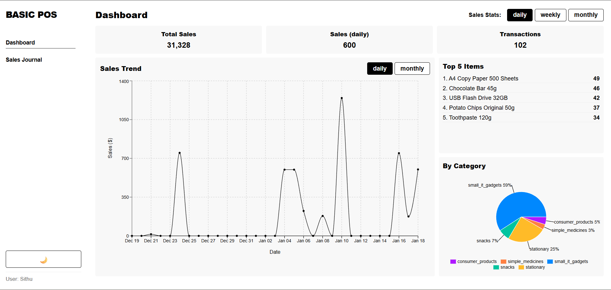
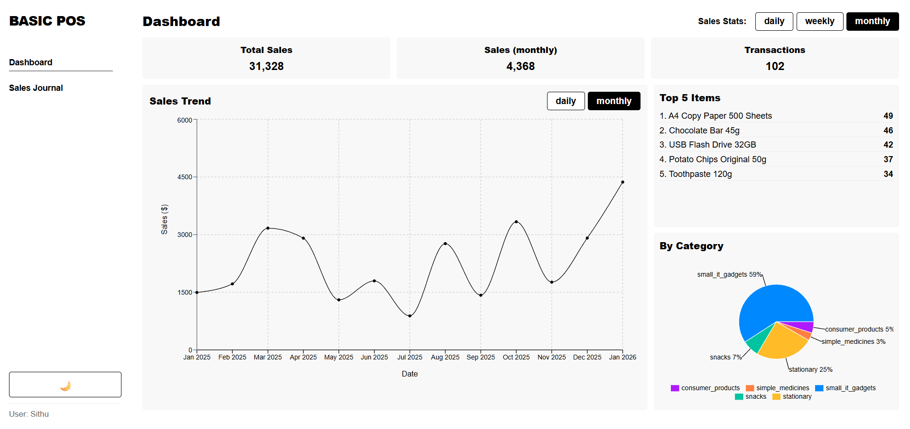
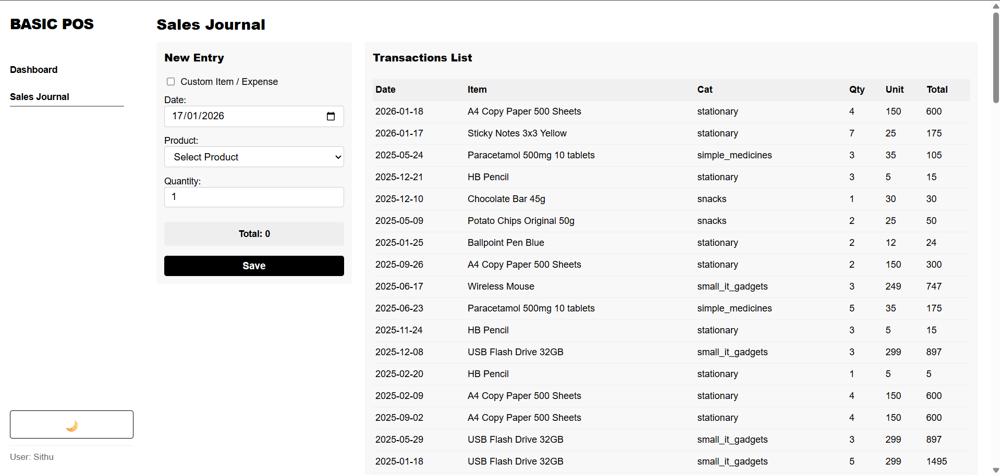
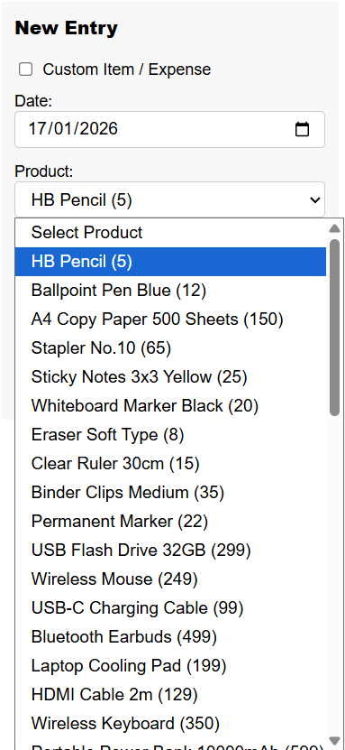
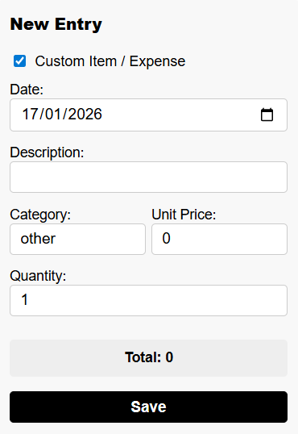
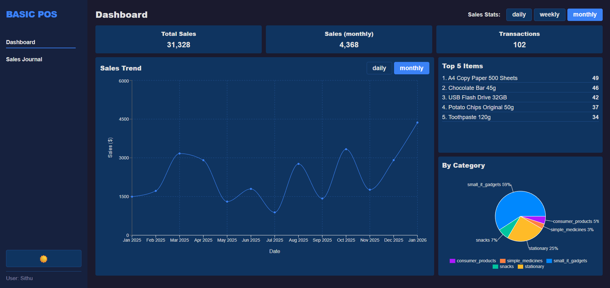

# Basic POS Application

## Introduction

This is a simple Point of Sale (POS) application built with React. It lists products, records sales transactions in Sales Journal and visualizes sales data on a Dashboard. The application is designed to be intuitive and easy to use.

## Members

**Sithu Win San**

**Aung Thura Hein**

## Features

- **Dashboard**: View sales stats, trends, and top-selling items.
- **Sales Journal**: Record new sales and view all transaction history.
- **Custom Expenses**: Support for adding custom items or expenses.
- **Dark Mode**: High-contrast dark theme with blue accents.

## Screenshots

### Dashboard
- **Daily Statistics**

- **Monthly Statistics**

### Sales Journal
The Sales Journal allows for efficient transaction recording and product management.

| Sales Journal Overview | Product Selection | Custom Item Entry |
|:---:|:---:|:---:|
|  |  |  |

### Dark Mode Support

