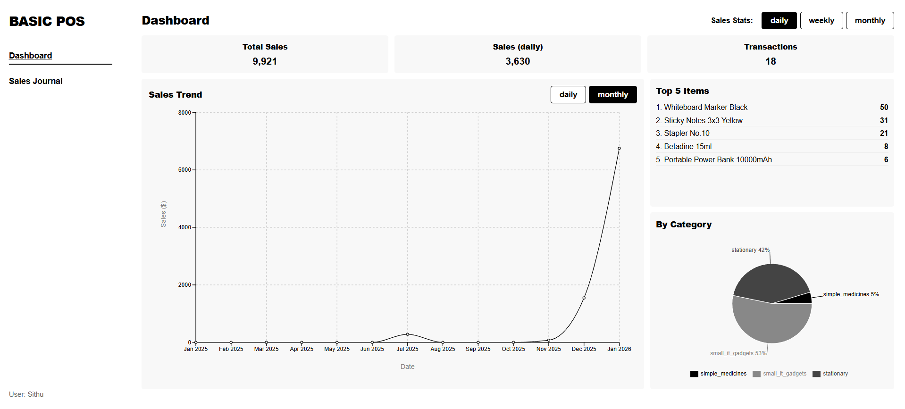
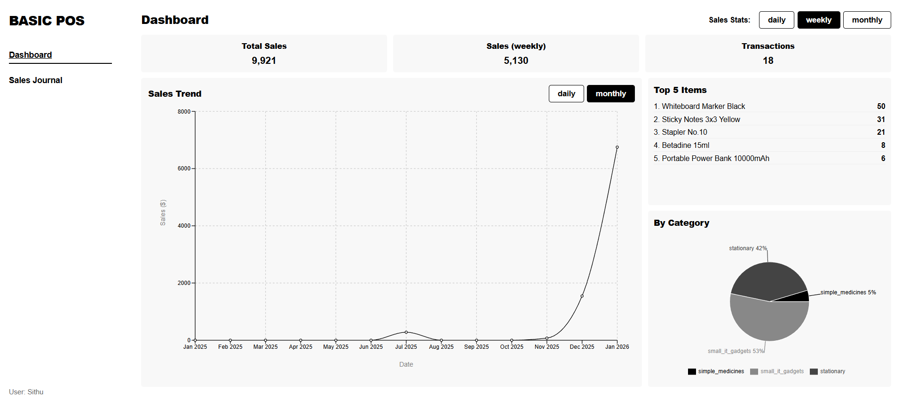
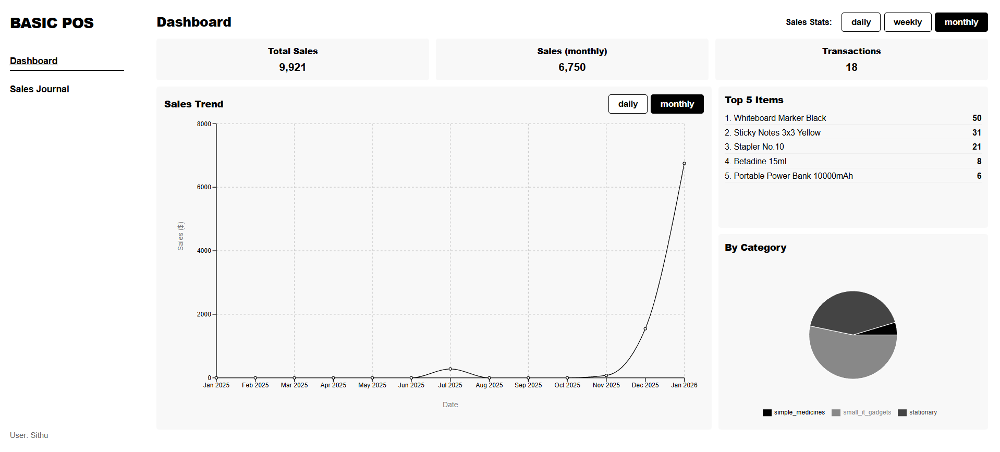
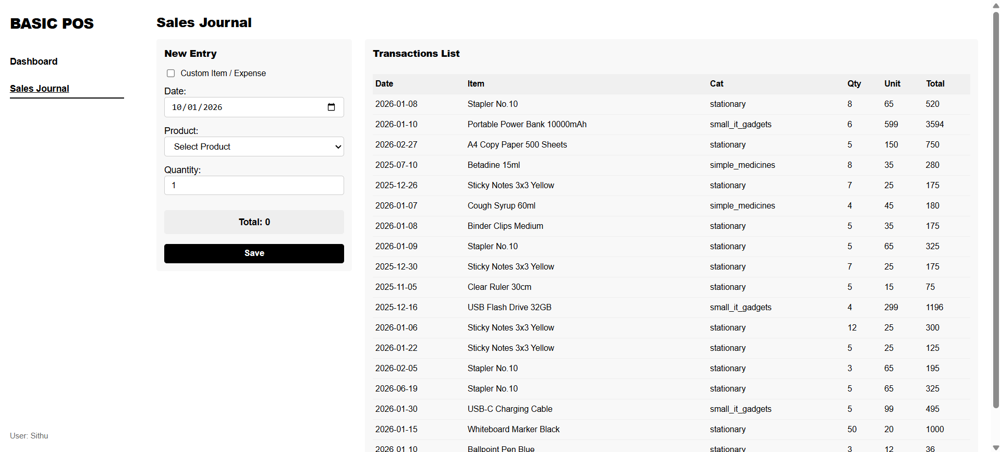
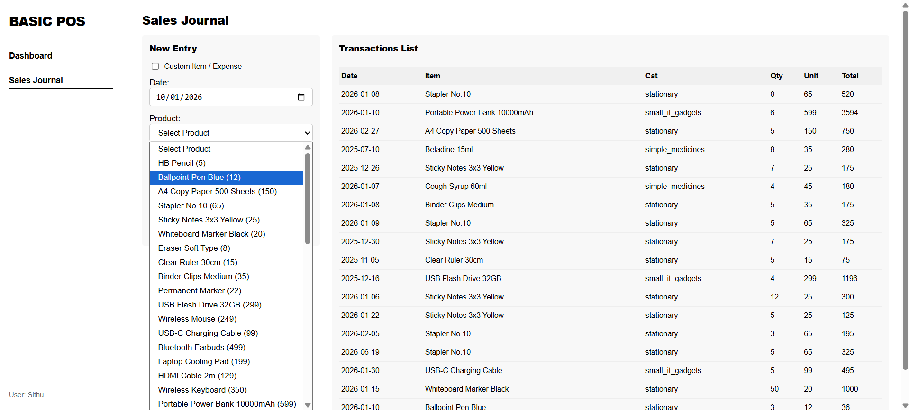

# Basic POS Application

## Introduction

This is a simple Point of Sale (POS) application built with React. It lists products, records sales transactions, and visualizes sales data on a dashboard. The application is designed to be intuitive and easy to use.

## Members

**Sithu Win San**

**Aung Thura Hein**

## Features

- **Dashboard**: View sales stats, trends, and top-selling items.
- **Sales Journal**: Record new sales and view transaction history.
- **Custom Expenses**: Support for adding custom items or expenses.
- **Data Persistence**: All data is saved locally in the browser.

## Screenshots

### Dashboard - Overview & Daily Sales Chart

### Dashboard - Monthly Sales Chart

### Dashboard - Weekly Sales

### Dashboard - Monthly Sales

### Sales Journal - Overview

### Sales Journal - Product Selection

